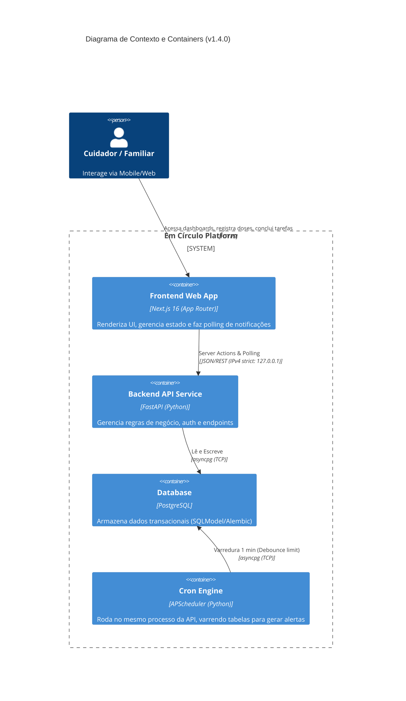

# Software Design Document (SDD) — Em Círculo

## 1. Visão Arquitetural
O **Em Círculo** segue uma arquitetura baseada em microsserviços lógicos, consistindo de um Frontend Server-Side Rendered acoplado a uma API assíncrona orientada a eventos transacionais.

### 1.1. C4 Context & Container Diagram



---

## 2. Tech Stack Confirmada

- **Frontend:** Next.js 16 (App Router), React, Tailwind CSS (JINC Neutral Palette), Sonner (Toasts AAA).
- **Backend:** FastAPI (Python 3.11+), SQLModel, SQLAlchemy (asyncio), Uvicorn.
- **Background Jobs:** APScheduler (AsyncIOScheduler) acoplado no _lifespan_ do FastAPI.
- **Banco de Dados:** PostgreSQL (migrações via Alembic).
- **Rede & Proxy:** Node.js 18+ com Turbopack (Exige binds explícitos em `127.0.0.1` contra IPv6 ECONNREFUSED).

---

## 3. Topologia de Dados (Principais Entidades)

O núcleo do sistema orbita ao redor do `CareGroup` (Círculo de Cuidado).
- `User`: Identidade (Hash Auth).
- `CareGroup`: Agregador do paciente (`CareRecipient`) e seus cuidadores (`CareGroupMember`).
- `Task`: Tarefas isoladas designadas (`assignee_id`) ou livres, atreladas ao Grupo.
- `MedicationProtocol`: A espinha dorsal da medicação. Define `dosage` e `frequency_interval_hours`. Possui um gatilho mecânico `next_due_at` que avança a cada dose injetada.
- `MedicationLog`: Log imutável da execução de uma dose por um cuidador no tempo.
- `Notification`: Tabela de Event-Sourcing leve consumida periodicamente pelo frontend (Polling).
- `Appointment`: Entidade para a Agenda de Consultas, atrelada por foreign key ao `CareRecipient`. Campos core da modelagem: `title` (título), `scheduled_at` (data/hora UTC), `provider_name` (especialista/médico) e `location` (local).
- `ClinicalDocument`: Entidade para o Arquivo de Documentos Clínicos, atrelada ao `CareRecipient`. Contém metadados como título, tipo de documento (receita, laudo, exame) e data de upload.

---

## 4. Padrões de Integração e Zero-Trust

### 4.1. Sincronização Frontend-Backend (Smart Notifications)
O aplicativo não usa WebSockets para manter compatibilidade serverless. Ao invés disso, utiliza **HTTP Polling** isolado em um *Client Component* (`NotificationBell`).
1. O frontend mantém referência ao `lastSeenId`.
2. A cada 30 segundos, consulta `GET /api/v1/care-groups/{id}/notifications?after={timestamp}`.
3. Se novos itens surgirem, atualiza a badge e dispara Toasts.

### 4.2. Motor de Cron (Auto-Scheduling)
O backend possui um motor em background (`app/scheduler.py`).
1. A cada 1 minuto, varre `MedicationProtocol` onde `next_due_at < now - 10 min`.
2. Utiliza a coluna de trava (`last_delay_alert_sent_at`) para evitar envios duplicados na mesma janela de atraso.
3. Insere alertas tipo `DOSE_ATRASADA` na tabela de `notifications`.

### 4.3. Rotas da API Core
As interações do frontend Server Actions utilizam endpoints REST assíncronos expostos pelo FastAPI:
- `/api/v1/care-groups`: Gestão do círculo de cuidado e polling de notificações.
- `/api/v1/tasks`: Criação, conclusão e atribuição de tarefas dentro do grupo.

### 4.4. Políticas de Acesso (RBAC) e Consultas
Como regra arquitetural de Zero-Trust, **todo** endpoint da agenda (GET, POST, PATCH) deve obrigatoriamente cruzar o `care_group_id` fornecido na rota com a tabela `CareGroupMember` para validar se o `current_user` possui pertencimento ativo ao círculo. Nenhuma operação na tabela `Appointment` deve ocorrer sem essa validação prévia.

### 4.5. Estratégia de Armazenamento de Arquivos Clínicos (Storage)
Adota-se um padrão 'S3-compatible' (AWS S3 para produção, MinIO para ambiente local/dev). O banco PostgreSQL armazenará apenas a URI do arquivo, nunca o binário (BLOB). Como premissa de Segurança Zero-Trust, os URLs gerados para download ou visualização deverão ser pré-assinados (Presigned URLs) com tempo de expiração curto, exigindo validação RBAC estrita de 'CareGroupMember' antes da geração do link.

---

## 5. Topologia do Frontend — Home Page Modular

### 5.1. Roteamento e Responsabilidade da `page.tsx`

A rota `/` é dividida em dois cenários:
- **Usuário autenticado** (possui cookie `cc_access_token`): redirecionado para o painel interno (`/dashboard` ou rota existente com grupos de cuidado).
- **Usuário não autenticado**: renderiza a Home Page pública, composta pelos 6 componentes de apresentação modulares abaixo.

A Home Page é uma página **puramente estática** (Server Component, `cache: 'force-cache'`). Nenhuma chamada de API é realizada nesta rota.

### 5.2. Hierarquia de Componentes (`src/components/home/`)

```
app/page.tsx
└── <main id="main-content">
    ├── <HeroSection>           — Título principal, subtexto e CTAs (/login)
    ├── <ProblemSection>        — 3 cards de dor: Sobrecarga, Informações espalhadas, Insegurança
    ├── <SolutionSection>       — 4 cards de solução: Tarefas, Medicamentos, Histórico, Convites
    ├── <HowItWorksSection>     — 3 passos sequenciais: Criar, Convidar, Compartilhar
    ├── <AccessibilitySection>  — Compromisso WCAG 2.2 e inclusão
    └── <FinalCtaSection>       — Chamada final de conversão com CTA duplicado
```

### 5.3. Padrão de Isolamento (CSS Modules)

Cada componente é pareado com seu próprio arquivo `.module.css`, garantindo:
- **Escopo de estilos**: sem vazação de classes entre componentes.
- **Coesidade**: o componente carrega seus estilos via `import styles from './NomeComponente.module.css'`.
- **Zero conflito global**: a única folha de estilos global é `globals.css` (tokens de design, reset, tipografia).

### 5.4. CTAs e Roteamento

Todos os botões de conversão da Home apontam para `/login`, que serve tanto o fluxo de login quanto o de cadastro. Não há rotas de API novas para esta página.

### 5.5. Acessibilidade (WCAG 2.2 AAA — Obrigatório)

- `<main id="main-content">` como ponto de ancora do `<SkipLink>` já existente.
- Todos os botões com `aria-label` descritivo.
- Contraste mínimo de 7:1 (palette neutral do JINC).
- `focus-visible` em todos os elementos interativos.
- Resposta a `prefers-reduced-motion` em todas as animações CSS.
