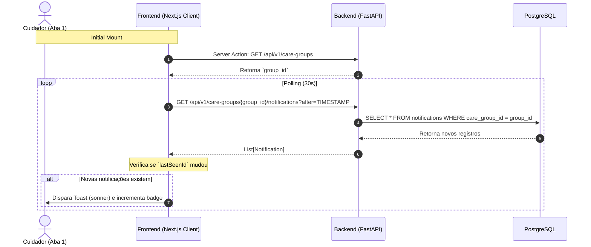

# Especificação Técnica — Notificações Inteligentes (v0.4)

## 1. Contexto e Objetivos
A fase 10.1 implementa a camada de sincronização online in-app para o Círculo de Cuidado. O backend gerará registros transacionais assíncronos no formato de Notificações quando ações críticas ocorrerem. O frontend Next.js App Router fará a leitura via um client-component (`NotificationBell`) rodando um loop de HTTP Polling otimizado para o backend FastAPI.

---

## 2. Diagrama C4 (Container) - Fluxo de Polling



---

## 3. Contratos de API (FastAPI)

### Schemas Pydantic

```python
import uuid
from typing import Optional
from pydantic import BaseModel, ConfigDict
from datetime import datetime
from enum import Enum

class NotificationType(str, Enum):
    DOSE_REGISTERED = "DOSE_REGISTERED"
    TASK_CREATED = "TASK_CREATED"
    TASK_COMPLETED = "TASK_COMPLETED"
    STOCK_ALERT = "STOCK_ALERT"

class NotificationCreate(BaseModel):
    care_group_id: uuid.UUID
    title: str
    message: str
    type: NotificationType

class NotificationResponse(BaseModel):
    model_config = ConfigDict(from_attributes=True)
    id: uuid.UUID
    care_group_id: uuid.UUID
    title: str
    message: str
    type: NotificationType
    is_read: bool
    created_at: datetime
```

### Endpoints

**`GET /api/v1/care-groups/{group_id}/notifications`**
- **Auth:** Requer JWT Bearer Token e Role válida.
- **Parâmetros:**
  - `limit`: int (Default 20)
  - `skip`: int (Default 0)
- **Response:** `200 OK` → `List[NotificationResponse]`
- **Comportamento:** Retorna a timeline do círculo ordenado de forma decrescente pelo timestamp.

---

## 4. Regras de Negócio e Invariantes (Core Engine)

### BR-NOT-01: Auto-Trigger Medication
- **Ação:** O endpoint `POST /api/v1/care-recipients/{recipient_id}/medication-logs` injeta uma notificação `DOSE_REGISTERED` explicitando o medicamento e a dosagem registrados.

### BR-NOT-02: Auto-Trigger Task
- **Ação:** O endpoint `POST /api/v1/care-groups/{group_id}/tasks` injeta uma notificação `TASK_CREATED` referenciando o título da tarefa.
- **Ação:** O endpoint `POST /api/v1/tasks/{task_id}/complete` injeta uma notificação `TASK_COMPLETED`.

---

## 5. Estratégia Frontend e Zero-Trust Networking

- **IPv4 Explicit Rule:** A conexão das Server Actions via `fetch` requer a resolução explícita por `127.0.0.1` ao invés de `localhost` para evitar `ECONNREFUSED` imposto pelo stack Node 18+ em arquiteturas de proxy turbopack.
- **Client Side Isolation:** O `NotificationBell` é um Client Component isolado na top-bar da `<Navigation />`. Ele gerencia a própria state-machine de polling (via `setInterval`) com cleanup robusto, independente do rest-rendering pipeline do Server Component.
- **Micro-interações (Toast AAA):** Quando detectado um ID de notificação novo (`lastSeenIdRef !== newestId`), executa a chamada a `toast.info` do `sonner`. Clicks no badge navegam para `/notificacoes`.


## 6. Fase 10.2: Fundação de Dados e Agendamento

### 6.1. Modificações no Modelo de Dados (PostgreSQL / SQLModel)
**Tabela:** `medication_protocols`
- `next_due_at` (DateTime, indexado, opcional): Indica quando a próxima dose do medicamento deve ser tomada.
- `assignee_id` (UUID, FK para `care_group_members.id`, opcional): Responsável pelo protocolo dentro do grupo.

### 6.2. Regra de Negócio (Auto-Agendamento)
- **Ação:** Endpoint `POST /api/v1/medications/{id}/logs`
- **Condição:** Se o protocolo estiver vinculado a um `frequency_interval_hours` > 0.
- **Lógica:** `next_due_at = administered_at + timedelta(hours=frequency_interval_hours)`. O protocolo é salvo no banco com o novo valor.
