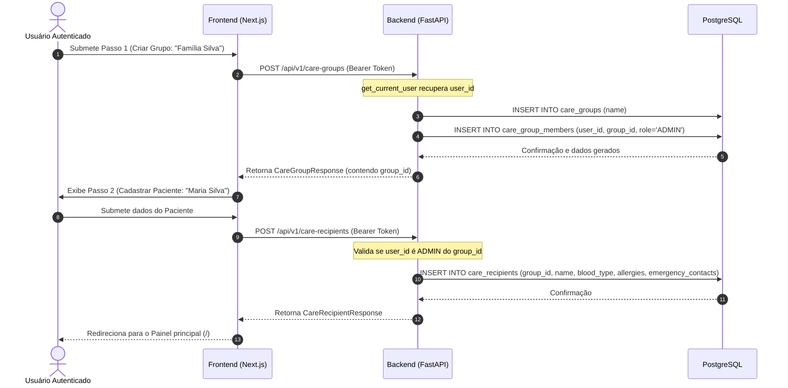

# Especificação Técnica — Onboarding (v0.3)

## 1. Contexto e Objetivos
Definir a modelagem e os contratos necessários para guiar o usuário recém-registrado na criação do círculo de cuidado (`CareGroup`) e no cadastro da pessoa assistida (`CareRecipient`), estruturando as regras de autorização e integridade referencial do banco de dados PostgreSQL.

---

## 2. Diagrama C4 (Container) - Fluxo de Onboarding



---

## 3. Contratos de API (FastAPI)

### 🤖 AI-Ready Layer (Machine Consumable)

#### Schemas Pydantic

```python
import uuid
from typing import Optional, List, Any
from pydantic import BaseModel, ConfigDict
from datetime import datetime

# ── Care Group Schemas ──────────────────────────────────────────────────────

class CareGroupCreate(BaseModel):
    """Payload para POST /api/v1/care-groups. Apenas o nome é necessário no onboarding."""
    name: str

class CareGroupResponse(BaseModel):
    model_config = ConfigDict(from_attributes=True)
    
    id: uuid.UUID
    name: str
    created_at: datetime
    updated_at: datetime

# ── Care Recipient Schemas ──────────────────────────────────────────────────

class CareRecipientCreate(BaseModel):
    """Payload para POST /api/v1/care-recipients."""
    care_group_id: uuid.UUID
    name: str
    blood_type: Optional[str] = None
    allergies: List[str] = []
    emergency_contacts: List[dict[str, Any]] = []

class CareRecipientResponse(BaseModel):
    model_config = ConfigDict(from_attributes=True)
    
    id: uuid.UUID
    care_group_id: uuid.UUID
    name: str
    blood_type: Optional[str]
    allergies: List[str]
    emergency_contacts: List[dict[str, Any]]
    created_at: datetime
    updated_at: datetime
```

#### API Endpoints

**`POST /api/v1/care-groups`**
- **Auth:** Requer JWT Bearer Token (`get_current_user`).
- **Request Body:** `CareGroupCreate`
- **Response:** `201 Created` → `CareGroupResponse`
- **Business Rule (BR-CG-01):** O usuário autenticado criador do grupo deve ser automaticamente cadastrado na tabela `care_group_members` associado ao `care_group_id` recém-criado, com a role `ADMIN` e timestamp de entrada.

**`POST /api/v1/care-recipients`**
- **Auth:** Requer JWT Bearer Token (`get_current_user`).
- **Request Body:** `CareRecipientCreate`
- **Response:** `201 Created` → `CareRecipientResponse`
- **Business Rule (BR-CR-01):** O usuário que submete a requisição deve obrigatoriamente ser um membro do grupo `care_group_id` especificado, possuindo a role `ADMIN`. Caso contrário, retorna `403 Forbidden`.
- **Business Rule (BR-CR-02) (Regra MVP):** Apenas 1 paciente pode ser associado a cada `CareGroup`. Se o grupo já possuir um receptor de cuidados ativo, retorna `409 Conflict`.

**`POST /api/v1/care-groups/{group_id}/tasks`**
- **Auth:** Requer JWT Bearer Token (`get_current_user`).
- **Request Body:** `TaskCreate`
- **Response:** `201 Created` → `TaskResponse`
- **Business Rule (BR-TSK-01):** O criador da tarefa deve ser membro do grupo `group_id`. Caso contrário, retorna `403 Forbidden`.

**`POST /api/v1/care-recipients/{recipient_id}/protocols`**
- **Auth:** Requer JWT Bearer Token (`get_current_user`).
- **Request Body:** `ProtocolCreate`
- **Response:** `201 Created` → `MedicationProtocolResponse`
- **Business Rule (BR-PRT-01):** O criador do protocolo de medicamento deve ser membro do grupo de cuidado que gerencia o receptor de cuidados `recipient_id`. Caso contrário, retorna `403 Forbidden`.

---

## 4. Regras de Negócio e Invariantes

### BR-CG-01: Auto-associação de Criador como ADMIN
- **Precondição:** Usuário JWT válido e ativo.
- **Entrada:** `CareGroupCreate`
- **Invariant:** Nenhum grupo de cuidado pode ser criado sem pelo menos um membro com a role `ADMIN`.
- **Ação:** Insere na base a entidade `CareGroup` e, de forma transacional, insere o registro correspondente em `care_group_members` vinculando o `user_id` decodificado do token com `role = UserRole.ADMIN`.

### BR-CR-01: Autorização de Cadastro de Paciente
- **Precondição:** Usuário JWT válido e ativo.
- **Entrada:** `CareRecipientCreate`
- **Invariant:** Somente o `ADMIN` de um círculo de cuidado pode adicionar o paciente àquele círculo.
- **Ação:** Busca na tabela `care_group_members` a entrada correspondente a `user_id` e `care_group_id`. Se a entrada não existir ou a `role` não for `ADMIN`, viola o acesso lançando erro `E_AUTH_FORBIDDEN` (HTTP 403).

### BR-TSK-01: Autorização de Criação de Tarefas
- **Precondição:** Usuário JWT válido e ativo.
- **Ação:** Valida a associação na tabela `care_group_members` para o `user_id` e `group_id`. Si o usuário não for membro do grupo, retorna `403 Forbidden`.

### BR-PRT-01: Autorização de Criação de Protocolos
- **Precondição:** Usuário JWT válido e ativo.
- **Ação:** Busca o `care_group_id` a partir do `recipient_id` informado. Valida a associação na tabela `care_group_members` para o `user_id` e `care_group_id`. Se o usuário não for membro do grupo, retorna `403 Forbidden`.

### BR-CG-02 & BR-CG-03: Autorização de Alteração de Grupo
- **Precondição:** Usuário JWT válido e membro do respectivo grupo.

### BR-CR-03 & BR-CR-04: Autorização de Alteração de Receptor
- **Precondição:** Usuário JWT válido e membro do respectivo grupo do receptor.

### BR-TSK-02 & BR-TSK-03: Autorização de Alteração de Tarefa
- **Precondição:** Usuário JWT válido e membro do respectivo grupo da tarefa.

### BR-PRT-02 & BR-PRT-03: Autorização de Alteração de Protocolo
- **Precondição:** Usuário JWT válido e membro do respectivo grupo do receptor do protocolo.

---

## 5. Endpoints de Controle Total (PATCH / DELETE - Fase 5)

**`PATCH /api/v1/care-groups/{group_id}`**
- **Auth:** Requer JWT Bearer Token.
- **Request Body:** `CareGroupUpdate`
- **Response:** `200 OK` → `CareGroupResponse`

**`DELETE /api/v1/care-groups/{group_id}`**
- **Auth:** Requer JWT Bearer Token.
- **Response:** `204 No Content`

**`PATCH /api/v1/care-recipients/{recipient_id}`**
- **Auth:** Requer JWT Bearer Token.
- **Request Body:** `CareRecipientUpdate`
- **Response:** `200 OK` → `CareRecipientResponse`

**`DELETE /api/v1/care-recipients/{recipient_id}`**
- **Auth:** Requer JWT Bearer Token.
- **Response:** `204 No Content`

**`PATCH /api/v1/tasks/{task_id}`**
- **Auth:** Requer JWT Bearer Token.
- **Request Body:** `TaskUpdate`
- **Response:** `200 OK` → `TaskResponse`

**`DELETE /api/v1/tasks/{task_id}`**
- **Auth:** Requer JWT Bearer Token.
- **Response:** `204 No Content`

**`PATCH /api/v1/protocols/{protocol_id}`**
- **Auth:** Requer JWT Bearer Token.
- **Request Body:** `ProtocolUpdate`
- **Response:** `200 OK` → `MedicationProtocolResponse`

**`DELETE /api/v1/protocols/{protocol_id}`**
- **Auth:** Requer JWT Bearer Token.
- **Response:** `204 No Content`

---

## 6. Círculo de Colaboração & RBAC (Fase 6)

### Alteração de Roles
A role `SUPPORT` foi descontinuada e renomeada para `CAREGIVER`.
A nova matriz de papéis (RBAC) está definida da seguinte forma:

| Funcionalidade / Rota | ADMIN | CAREGIVER |
| --- | --- | --- |
| Visualizar dados (GET) | Sim | Sim |
| Criar/Editar recursos (POST/PATCH) | Sim | Sim |
| Gerar Convites (`POST /api/v1/invites`) | **Sim** | Não (403) |
| Excluir recursos (`DELETE`) | **Sim** | Não (403) |

### Novos Contratos de API (FastAPI)

#### Schemas Pydantic
```python
class InviteCreate(BaseModel):
    care_group_id: uuid.UUID

class InviteResponse(BaseModel):
    token: str
    invite_link: str

class InviteAccept(BaseModel):
    token: str
```

#### Endpoints
**`POST /api/v1/invites`**
- **Auth:** Requer JWT Bearer Token e Role `ADMIN`.
- **Request Body:** `InviteCreate`
- **Response:** `201 Created` → `InviteResponse`
- **Comportamento:** Cria um token JWT contendo `sub: "invite"`, o ID do grupo de cuidado `care_group_id` e data de expiração definida para **48 horas** a partir do momento atual.

**`POST /api/v1/invites/accept`**
- **Auth:** Requer JWT Bearer Token.
- **Request Body:** `InviteAccept`
- **Response:** `200 OK`
- **Comportamento:** Processa a validação do token JWT de convite. Em caso de sucesso, verifica se o usuário já é membro do grupo. Caso não seja, insere o usuário atual na tabela `care_group_members` vinculando-o ao grupo com a role `CAREGIVER`.

---

## 7. Controle de Acesso e Segurança (FastAPI Dependency)
A dependência `require_role(allowed_roles: List[UserRole])` resolve o contexto do Círculo de Cuidado (a partir de parâmetros de rota como `group_id`, `recipient_id`, `task_id` ou `protocol_id`) e valida se o membro ativo possui um dos papéis autorizados. Todas as rotas de exclusão física (`DELETE`) agora exigem a role `ADMIN`.

---

## 8. Rastreabilidade & Histórico Clínico (Fase 7)

### Novos Contratos de API (FastAPI)

#### Schemas Pydantic
```python
class MedicationLogTimelineResponse(BaseModel):
    id: uuid.UUID
    protocol_id: uuid.UUID
    medication_name: str
    dosage: str
    administered_by: str  # Nome do cuidador (User.full_name)
    administered_at: datetime
    notes: Optional[str] = None
```

#### Endpoints
**`GET /api/v1/care-recipients/{recipient_id}/medication-logs`**
- **Auth:** Requer JWT Bearer Token e Role `ADMIN` ou `CAREGIVER` (membro do grupo do receptor).
- **Parâmetros de Rota:** `recipient_id` (UUID)
- **Response:** `200 OK` → `List[MedicationLogTimelineResponse]`
- **Comportamento:** Retorna os registros de administração de medicamentos do receptor, ordenados decrescentemente por `administered_at`. O backend resolve via JOINs os nomes dos medicamentos e dos cuidadores correspondentes.


