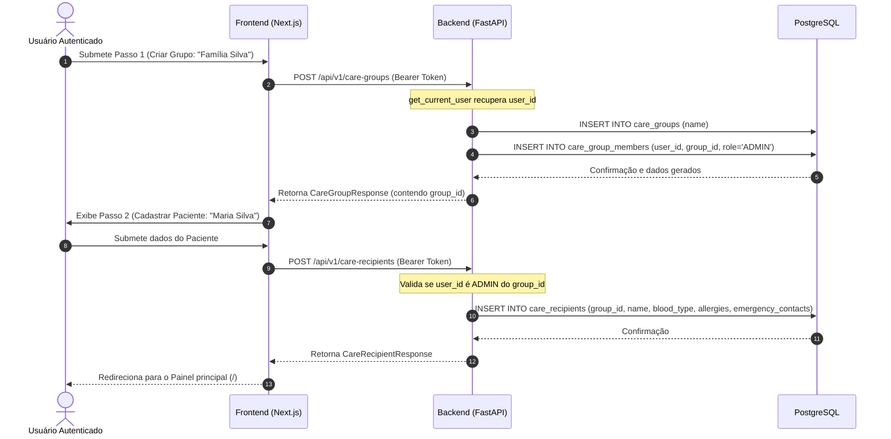

# Especificação Técnica — Onboarding (v0.3)

## 1. Contexto e Objetivos
Definir a modelagem e os contratos necessários para guiar o usuário recém-registrado na criação do círculo de cuidado (`CareGroup`) e no cadastro da pessoa assistida (`CareRecipient`), estruturando as regras de autorização e integridade referencial do banco de dados PostgreSQL.

---

## 2. Diagrama C4 (Container) - Fluxo de Onboarding



---

## 3. Contratos de API (FastAPI)

### 🤖 AI-Ready Layer (Machine Consumable)

#### Schemas Pydantic

```python
import uuid
from typing import Optional, List, Any
from pydantic import BaseModel, ConfigDict
from datetime import datetime

# ── Care Group Schemas ──────────────────────────────────────────────────────

class CareGroupCreate(BaseModel):
    """Payload para POST /api/v1/care-groups. Apenas o nome é necessário no onboarding."""
    name: str

class CareGroupResponse(BaseModel):
    model_config = ConfigDict(from_attributes=True)
    
    id: uuid.UUID
    name: str
    created_at: datetime
    updated_at: datetime

# ── Care Recipient Schemas ──────────────────────────────────────────────────

class CareRecipientCreate(BaseModel):
    """Payload para POST /api/v1/care-recipients."""
    care_group_id: uuid.UUID
    name: str
    blood_type: Optional[str] = None
    allergies: List[str] = []
    emergency_contacts: List[dict[str, Any]] = []

class CareRecipientResponse(BaseModel):
    model_config = ConfigDict(from_attributes=True)
    
    id: uuid.UUID
    care_group_id: uuid.UUID
    name: str
    blood_type: Optional[str]
    allergies: List[str]
    emergency_contacts: List[dict[str, Any]]
    created_at: datetime
    updated_at: datetime
```

#### API Endpoints

**`POST /api/v1/care-groups`**
- **Auth:** Requer JWT Bearer Token (`get_current_user`).
- **Request Body:** `CareGroupCreate`
- **Response:** `201 Created` → `CareGroupResponse`
- **Business Rule (BR-CG-01):** O usuário autenticado criador do grupo deve ser automaticamente cadastrado na tabela `care_group_members` associado ao `care_group_id` recém-criado, com a role `ADMIN` e timestamp de entrada.

**`POST /api/v1/care-recipients`**
- **Auth:** Requer JWT Bearer Token (`get_current_user`).
- **Request Body:** `CareRecipientCreate`
- **Response:** `201 Created` → `CareRecipientResponse`
- **Business Rule (BR-CR-01):** O usuário que submete a requisição deve obrigatoriamente ser um membro do grupo `care_group_id` especificado, possuindo a role `ADMIN`. Caso contrário, retorna `403 Forbidden`.
- **Business Rule (BR-CR-02) (Regra MVP):** Apenas 1 paciente pode ser associado a cada `CareGroup`. Se o grupo já possuir um receptor de cuidados ativo, retorna `409 Conflict`.

---

## 4. Regras de Negócio e Invariantes

### BR-CG-01: Auto-associação de Criador como ADMIN
- **Precondição:** Usuário JWT válido e ativo.
- **Entrada:** `CareGroupCreate`
- **Invariant:** Nenhum grupo de cuidado pode ser criado sem pelo menos um membro com a role `ADMIN`.
- **Ação:** Insere na base a entidade `CareGroup` e, de forma transacional, insere o registro correspondente em `care_group_members` vinculando o `user_id` decodificado do token com `role = UserRole.ADMIN`.

### BR-CR-01: Autorização de Cadastro de Paciente
- **Precondição:** Usuário JWT válido e ativo.
- **Entrada:** `CareRecipientCreate`
- **Invariant:** Somente o `ADMIN` de um círculo de cuidado pode adicionar o paciente àquele círculo.
- **Ação:** Busca na tabela `care_group_members` a entrada correspondente a `user_id` e `care_group_id`. Se a entrada não existir ou a `role` não for `ADMIN`, viola o acesso lançando erro `E_AUTH_FORBIDDEN` (HTTP 403).
